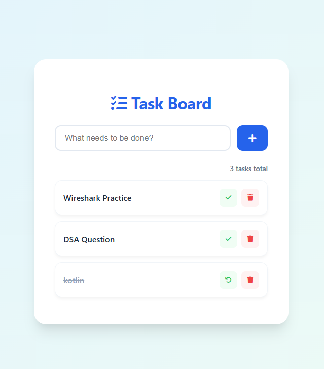
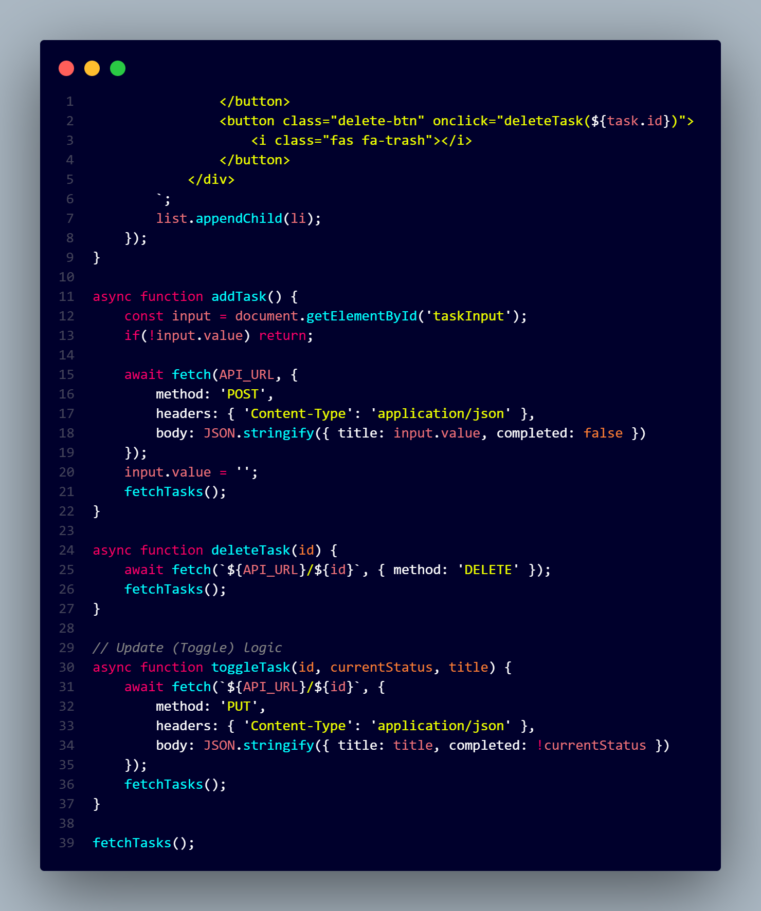

# ☁️ Cloudy Task Manager

A modern, high-performance **Task Management Application** built with **Spring Boot** and a sleek **Glassmorphic UI**.
This project demonstrates **end-to-end DevOps** from development to **Kubernetes deployment**.

---

# 🚀 Features

✨ Modern Glass UI
✨ Full CRUD (Create, Update, Delete, Toggle Status)
✨ REST API based architecture
✨ PostgreSQL database integration
✨ Docker containerized
✨ Kubernetes deployment ready
✨ Jenkins CI/CD pipeline
✨ Responsive design (Mobile + Desktop)

---

# 🛠️ Tech Stack

## Frontend

* HTML5
* CSS3 (Glassmorphism + Elevation UI)
* Vanilla JavaScript (Fetch API)

## Backend

* Java 17
* Spring Boot 3
* Spring Data JPA
* REST API

## Database

* PostgreSQL

## DevOps

* Docker
* Kubernetes
* Jenkins
* Ubuntu VM

---

# 📸 UI Preview

## Application UI

<p align="center">
  
</p>

## Code Structure

<p align="center">
  
</p>

Clean layered architecture using Controller → Service → Repository.

---

## Task Status

Toggle button with color indicators:

* 🟢 Completed
* 🔵 Pending
* 🔴 Delete action

---

# 🏗️ Architecture

3-Tier Architecture

Frontend (HTML/CSS/JS)
│
▼
Spring Boot REST API
│
▼
PostgreSQL Database

---

# 📁 Project Structure

```
task-manager
│
├── frontend
│   ├── index.html
│   ├── style.css
│   └── app.js
│
├── backend
│   └── spring-boot-app
│
├── k8s
│   ├── namespace.yaml
│   ├── frontend-deployment.yaml
│   ├── backend-deployment.yaml
│   └── postgres.yaml
│
├── screenshots
│   ├── app_ui.png
│   └── code.png
│
└── README.md
```

---

# ⚙️ Local Setup

## 1. Clone Repository

```
git clone https://github.com/yourusername/cloudy-task-manager.git
cd cloudy-task-manager
```

---

# 🐘 Database Setup

Create database

```
taskdb
```

Update `application.properties`

```
spring.datasource.url=jdbc:postgresql://localhost:5432/taskdb
spring.datasource.username=postgres
spring.datasource.password=password
```

---

# ▶️ Run Backend

```
mvn spring-boot:run
```

Backend runs on:

```
http://localhost:8080
```

---

# 🌐 Run Frontend

Open:

```
index.html
```

---

# 🐳 Docker Build

Backend

```
docker build -t cloudy/task-backend .
```

Frontend

```
docker build -t cloudy/task-frontend .
```

---

# ☸️ Kubernetes Deploy

```
kubectl apply -f k8s/
```

Check pods

```
kubectl get pods -n task-manager-aplication
```

---

# 🔄 CI/CD Pipeline

GitHub Push
↓
Jenkins Build
↓
Docker Image
↓
Push Docker Hub
↓
Kubernetes Deploy

---

# 📌 Future Improvements

* Authentication (JWT)
* User login system
* Task categories
* Due date reminders
* Dark mode UI
* Ingress + domain

---

# 👨‍💻 Author

Cloudy
Full Stack + DevOps Learner

---

# ⭐ If you like this project

Give it a star on GitHub!
